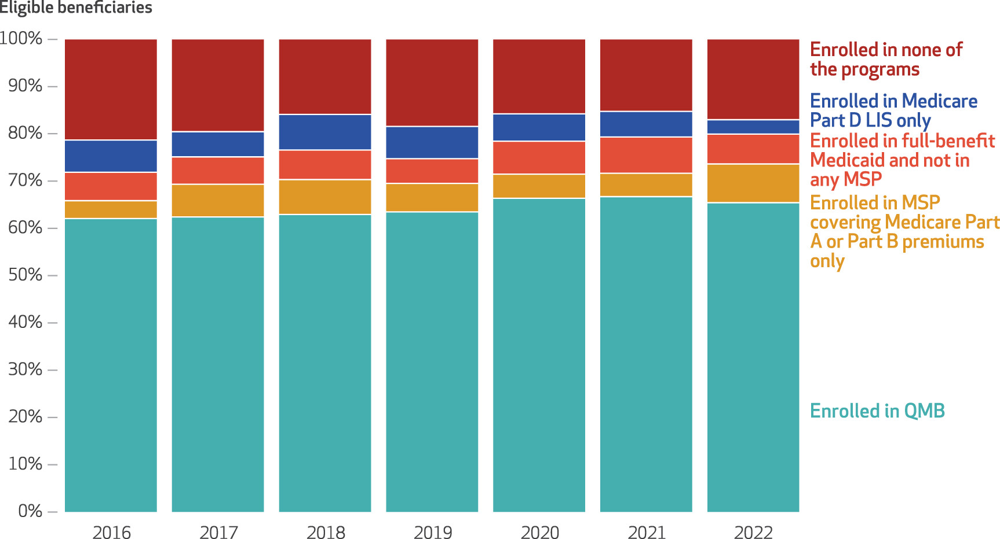
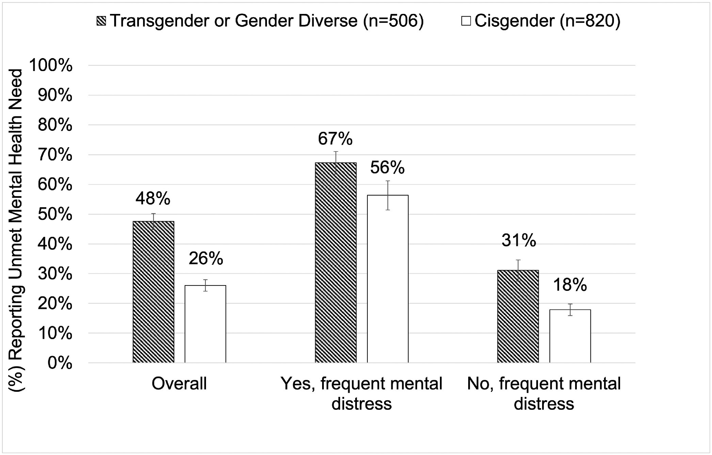
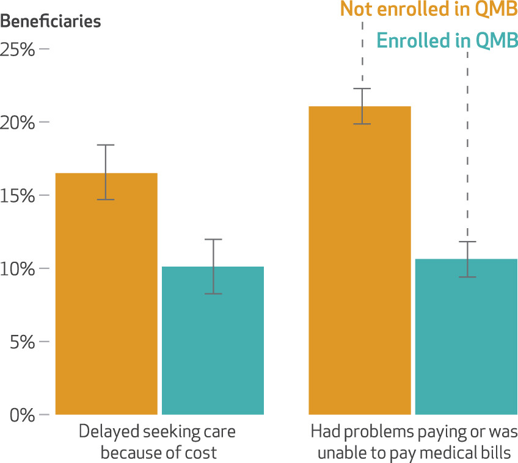
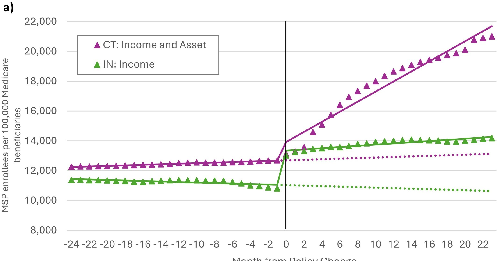

::: {.grid}

::: {.g-col-12 .g-col-md-4 .profile-col}

{.profile-photo}

## Wyatt Koma

PhD Candidate in Health Policy at Harvard University

[LinkedIn](https://www.linkedin.com/in/jwyattkoma/) · [Google Scholar](https://scholar.google.com/citations?hl=en&user=o2QIux8AAAAJ&view_op=list_works&sortby=pubdate) · [Email](mailto:jwkoma@fas.harvard.edu)

---

I'm a PhD candidate in Harvard's Health Policy program. My research leverages causal inference methods and large administrative datasets to answer policy-informing questions. I'm currently studying how Medicaid coverage of gender-affirming care affects mental health outcomes for transgender enrollees, how to improve the Medicare Savings Program for low-income beneficiaries moving between Medicaid and Medicare, and how pharmacy closures affect access to mental health care for people with serious mental illness. My work has appeared in *JAMA Health Forum*, *Health Affairs*, *Medical Care*, *LGBT Health*, and the *American Journal of Preventive Medicine*.

:::

::: {.g-col-12 .g-col-md-8 .figures-col}

::: {.grid}

::: {.g-col-12 .g-col-md-6}
{fig-alt="Stacked bar chart showing Medicare Savings Program enrollment distribution among eligible beneficiaries from 2016 to 2022"}
:::

::: {.g-col-12 .g-col-md-6}
{fig-alt="Bar chart showing rates of unmet mental health need among transgender and cisgender adults"}
:::

::: {.g-col-12 .g-col-md-6}
{fig-alt="Bar chart comparing health care access outcomes between QMB-enrolled and non-enrolled Medicare beneficiaries"}
:::

::: {.g-col-12 .g-col-md-6}
{fig-alt="Interrupted time series model showing Medicare Savings Program enrollment trends around policy changes"}
:::

:::

:::

:::
