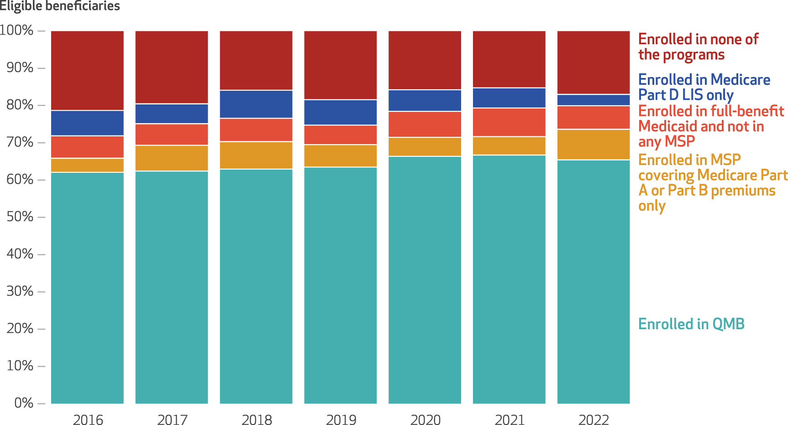
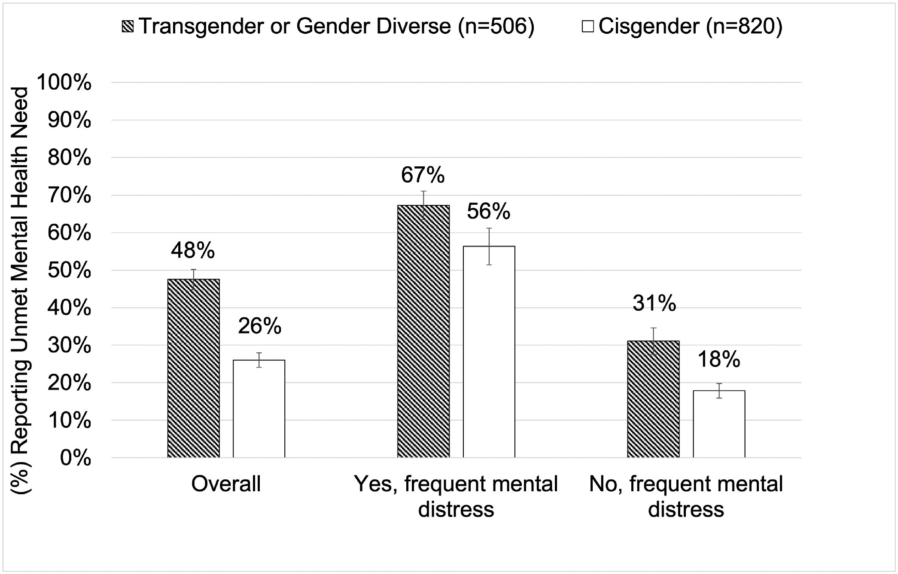
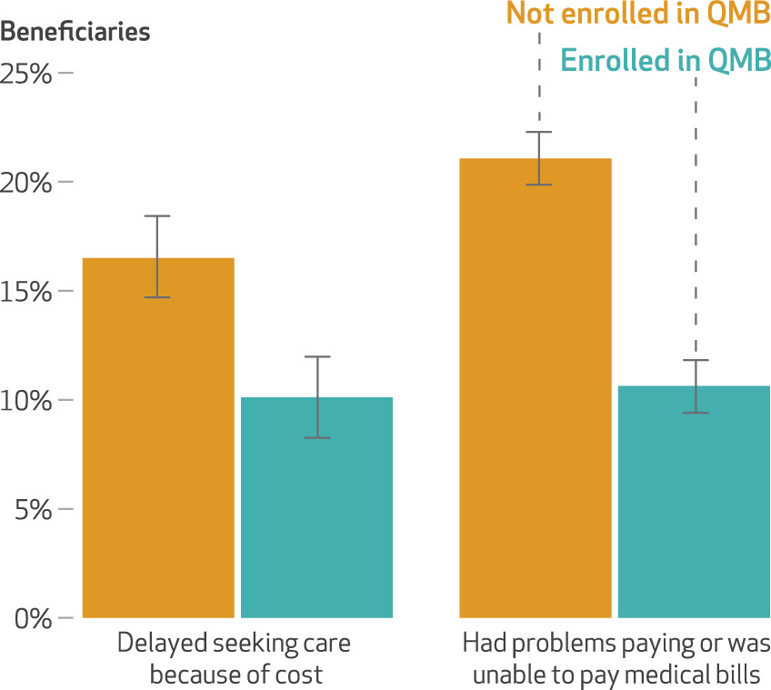
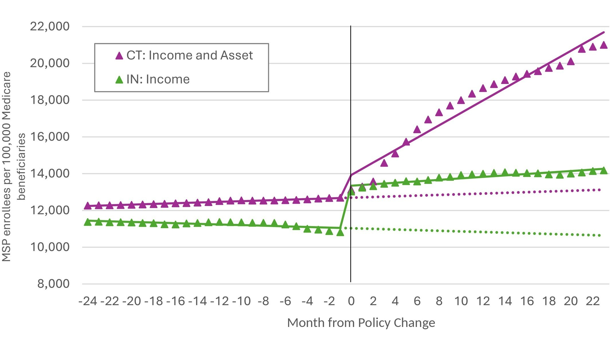

I'm on the academic job market for 2026–27 and will complete my PhD in Health Policy in May 2027.

My dissertation explains how public insurance programs can improve the mental health and quality of life for Americans with low incomes. Leveraging quasi-experimental methods and administrative data, my research makes two key contributions: understanding how to redesign public programs to improve health outcomes and how to expand access to prescription drugs. In my work, I pair methodological rigor with a deep understanding of the U.S. health policy landscape to produce research findings that address important, understudied questions facing policymakers, clinicians, and patients.

I've worked in health policy research since 2015, including nearly six years at the Kaiser Family Foundation (KFF) and NORC at the University of Chicago. In those roles, I used a wide range of data sources to address emerging policy questions, producing analyses that informed policymakers and journalists. I'm currently Project Director on a Commonwealth Fund grant.

I'm passionate about teaching essential health policy concepts and preparing the next generation of health policy leaders and researchers. I've taught health policy and research design at Harvard and MIT.

::: {.grid .home-figures}

::: {.g-col-12 .g-col-md-6}
{fig-alt="Stacked bar chart showing Medicare Savings Program enrollment distribution among eligible beneficiaries from 2016 to 2022"}
:::

::: {.g-col-12 .g-col-md-6}
{fig-alt="Bar chart showing rates of unmet mental health need among transgender and cisgender adults"}
:::

::: {.g-col-12 .g-col-md-6}
{fig-alt="Bar chart comparing health care access outcomes between QMB-enrolled and non-enrolled Medicare beneficiaries"}
:::

::: {.g-col-12 .g-col-md-6}
{fig-alt="Interrupted time series model showing Medicare Savings Program enrollment trends around policy changes"}
:::

:::
